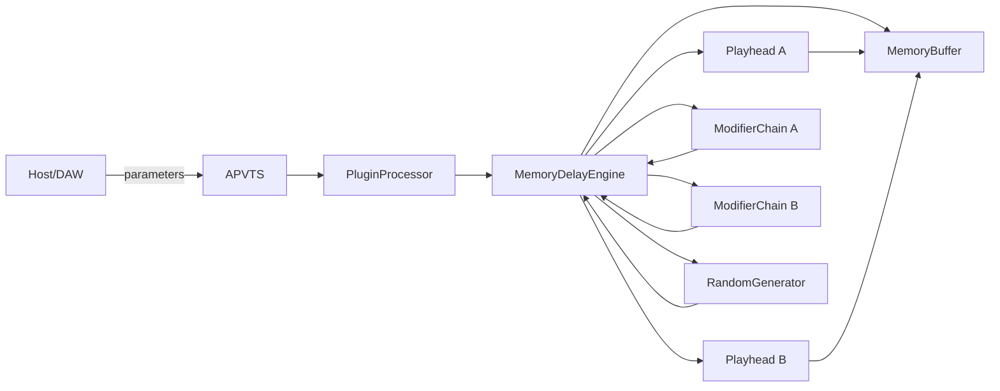
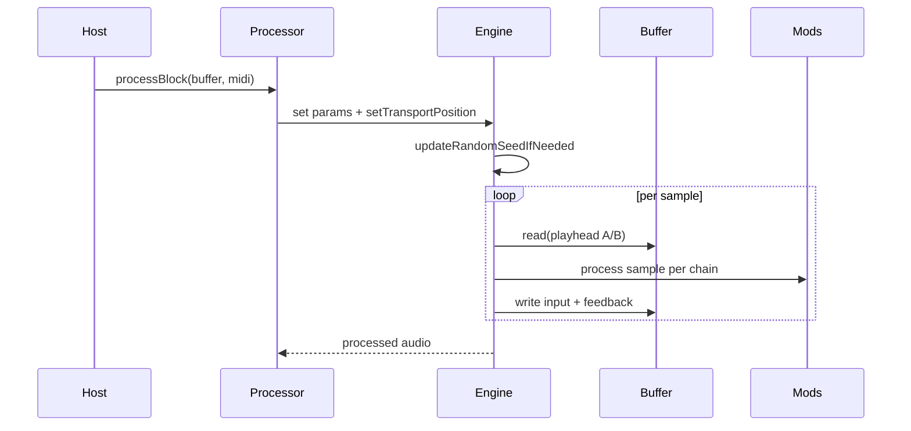
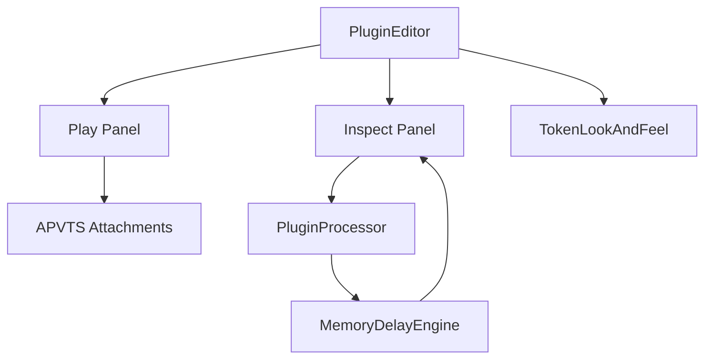
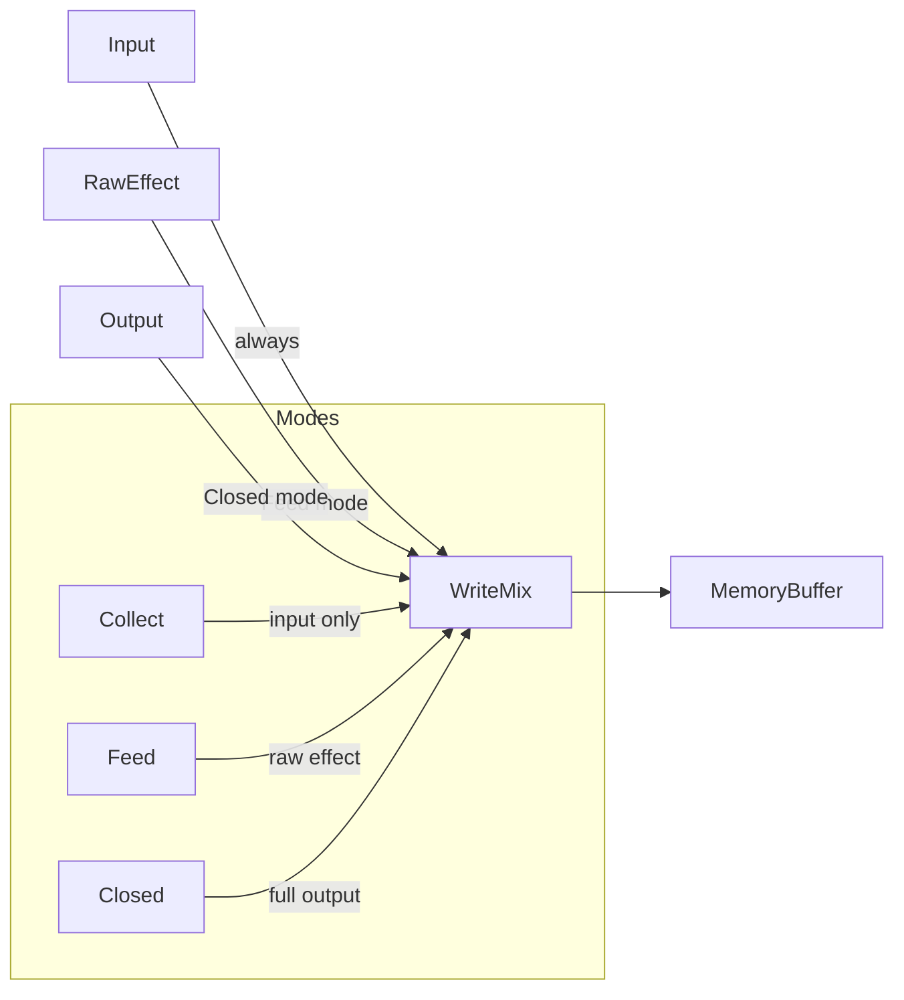

# Echoform Roadmap

This roadmap lays out the implementation plan in phases and includes Codex prompt templates plus architectural diagrams (Mermaid).

## Goals

- Expand DSP core with deterministic random modulation, automatic scanning, modifiers, and stereo/mode behaviors.
- Build a token-driven UI with Play and Inspect modes.
- Validate deterministic behavior and stability.
- Document features and keep the CMake build clean.

## Phase Plan

### Phase 0 - Project Baseline
- Verify JUCE CMake config and plugin formats (AU/VST3).
- Ensure no audio-thread allocations after prepareToPlay.
- Confirm buffer sizes and sample-rate independence.

### Phase 1 - Parameters and Engine Wiring
- Add parameters: autoScanRate, stereoMode, mode, character, randomSeed.
- Wire parameters to AudioProcessorValueTreeState and Editor attachments.
- Add transport-aware deterministic random seed handling.

### Phase 2 - Core DSP Features
- Automatic scan behavior for playheads with smoothing.
- Modifier chain (low-pass, pitch drift, wow/flutter, dropout).
- Feedback modes: Collect, Feed, Closed.
- Stereo modes: Independent, Linked, Cross.
- Feedback safety clamp and soft saturation.

### Phase 3 - UI and Visualization
- TokenLookAndFeel loads tokens from resources/visualdna_tokens.json.
- Play mode: main controls with token styling.
- Inspect mode: heatmap timeline + playhead positions, read-only.
- Responsive layout with Grid or FlexBox.

### Phase 4 - Determinism and QA
- Unit test harness for bit-identical offline renders.
- Stress test feedback extremes.
- CPU profiling and leak checks.

### Phase 5 - Release and Docs
- Update README with parameters and build steps.
- Verify CMake builds on macOS and Windows.
- Create a release branch and tag.

## Codex Prompt Implementation Plan

Use the following prompt templates to drive iterative changes. Each prompt is designed to be self-contained and to minimize scope creep.

### Prompt A - Parameters and State
```
You are working in a JUCE CMake plugin. Add parameters:
autoScanRate, stereoMode (Independent/Linked/Cross), mode (Collect/Feed/Closed),
character, randomSeed. Update the ParameterLayout, bind in the editor, and
ensure no allocations in the audio thread. Keep ASCII only.
```

### Prompt B - Deterministic Random and Auto Scan
```
Implement a deterministic RandomGenerator (XorShift or similar) seeded by
randomSeed + host transport position. Add automatic scan behavior to the
playhead with smoothing based on autoScanRate. Ensure offline renders with
the same seed are repeatable.
```

### Prompt C - Modifier Chain
```
Create a Modifier base class and a ModifierChain. Implement low-pass, pitch
drift, wow/flutter, and dropout modifiers. Map intensity from the character
macro. Allow accumulation in feedback for Closed mode only.
```

### Prompt D - Stereo and Feedback Modes
```
Implement stereo modes: Independent, Linked (mirrored reads), and Cross.
Implement feedback modes: Collect (input only), Feed (raw effect), Closed
(full output). Add safeguards for max feedback and avoid runaway gain.
```

### Prompt E - UI Modes and Tokens
```
Create TokenLookAndFeel that loads resources/visualdna_tokens.json and maps
colors, fonts, spacing, and radii. Refactor UI into Play and Inspect modes.
Inspect mode must be read-only and show a non-literal memory timeline with
playhead positions. Use Grid or FlexBox and token spacing.
```

### Prompt F - Determinism Test Harness
```
Add a JUCE UnitTest that processes identical audio twice with the same
seed and asserts bit-identical output. Document how to run the test.
```

## Architecture Diagrams

### DSP and Parameter Flow


### Audio Processing Sequence


### UI Modes and Data Flow


### Feedback and Mode Logic


## Notes and Constraints

- Never allocate in the audio thread after prepareToPlay.
- Keep modulation sample-rate independent.
- Keep randomness deterministic across offline renders.
- Use token fallbacks if resources/visualdna_tokens.json is missing.
